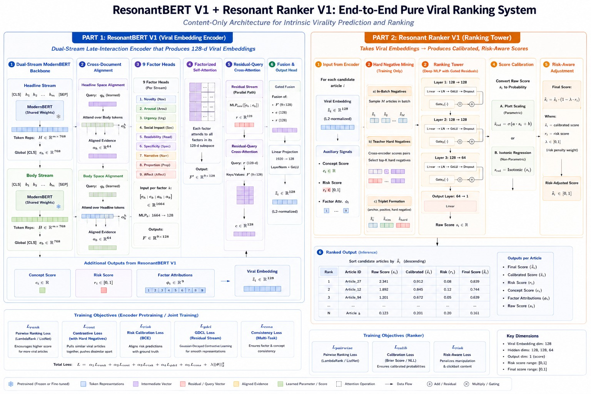
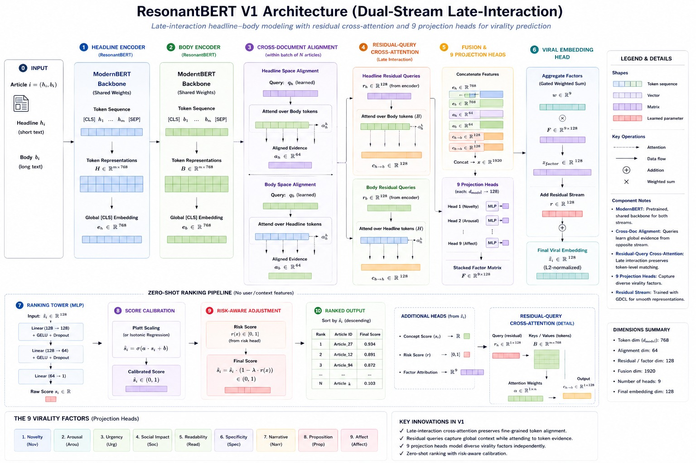
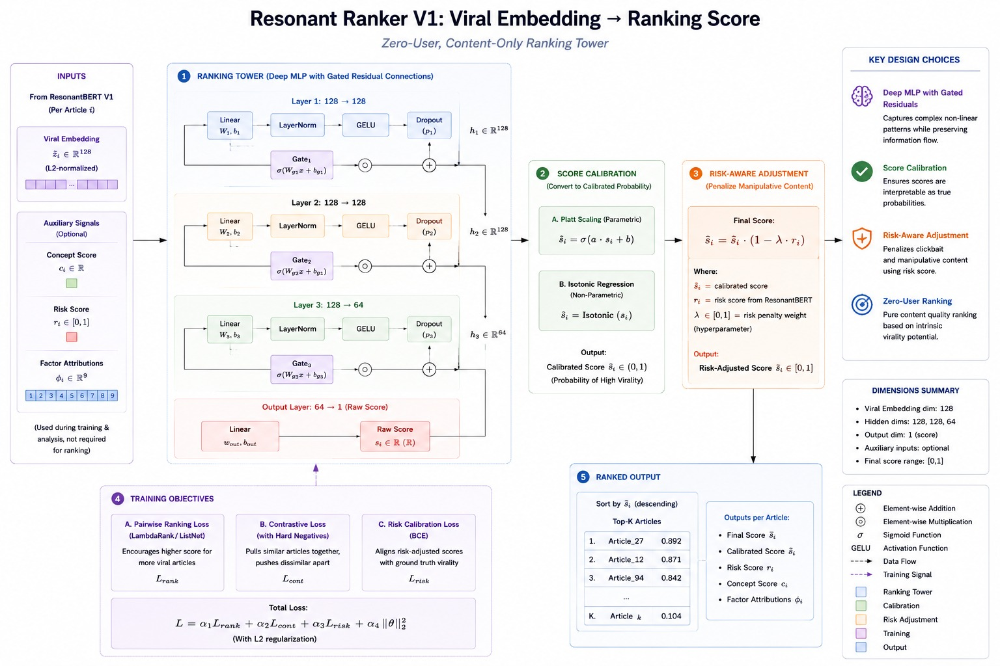

<div align="center">

# ResonantBERT + Resonant Ranker V1
## End-to-End Pure Viral Ranking System

**Content-Only Architecture for Intrinsic Virality Prediction and Ranking**

[](https://opensource.org/licenses/MIT)
[](https://www.python.org/downloads/)
[](https://pytorch.org/)
[](https://huggingface.co/transformers/)
[](#)

</div>

---

## 📑 Table of Contents
- [Overview](#overview)
- [Architecture](#architecture)
  - [Part 1: ResonantBERT V1](#part-1-resonantbert-v1)
  - [Part 2: Resonant Ranker V1](#part-2-resonant-ranker-v1)
- [Key Features](#key-features)
- [Installation](#installation)
- [Dataset](#dataset)
- [Usage](#usage)
- [Model Architecture Details](#model-architecture-details)
- [References](#references)

---

## 🎯 Overview

**ResonantBERT-ResonantRANK** is a two-stage end-to-end viral ranking system designed to predict and rank news articles by their intrinsic virality potential using **content features only** (no external signals like timestamps, user profiles, or engagement history).

### System Design Philosophy
The system is built on the premise that virality is determined by **content resonance** – how well content activates core human factors that drive sharing behavior. We decompose this into two complementary models:

1. **ResonantBERT V1** (Encoder): Produces 128-dimensional **viral embeddings** that capture intrinsic virality patterns
2. **Resonant Ranker V1** (Ranker): Transforms embeddings into calibrated, risk-adjusted virality scores

---

## 🏗️ Architecture

### System Overview Diagram


---

### Part 1: ResonantBERT V1
#### Dual-Stream Late-Interaction Encoder with 9 Virality Factors



**Input:** News articles (headline + body text)  
**Output:** 128-d viral embedding + auxiliary signals (concept score, risk score, factor attributions)

#### Architecture Components

##### 1. **Dual-Stream Backbone**
- ModernBERT (shared weights across headline and body streams)
- Preserves late-interaction modeling: headline-body cross-interaction happens at the classification layer
- Both streams: 768-dim hidden state + [CLS] pooling

```
Headline Stream:     Body Stream:
  [CLS] h₁ ... hₙ     [CLS] b₁ ... bₘ
     ↓                    ↓
   eₕ (B, 768)        eᵦ (B, 768)
   Hmat (B, n, 768)   Bdmat (B, m, 768)
```

##### 2. **Cross-Document Alignment** 
Learned query attention mechanism that aligns headline and body perspectives:

- **Headline→Body Alignment:** Headline query attends over body tokens → aₕ (B, 64)
- **Body→Headline Alignment:** Body query attends over headline tokens → aᵦ (B, 64)

**Design Insight:** Captures cross-document relationships that contribute to virality (e.g., headline-body congruence signals credibility, conflicts signal clickbait)

##### 3. **Evidence Construction** (1664-dim)
```
evidence = concat[eₕ, eᵦ, aₕ, aᵦ]
         = (B, 768 + 768 + 64 + 64) = (B, 1664)
```

##### 4. **Nine Virality Factor Heads** (9 × 128-dim)
Parallel projections of evidence into 9 distinct virality factors:

| Factor | Meaning |
|--------|---------|
| **Novelty** | New information / unexpectedness |
| **Arousal** | Emotional activation intensity |
| **Urgency** | Time-sensitivity / immediacy |
| **Social Impact** | Relevance to social groups |
| **Readability** | Accessibility / clarity |
| **Specificity** | Concreteness / detail level |
| **Narrative** | Story structure strength |
| **Proportion** | Content depth vs. headline ratio |
| **Affect** | Emotional valence (positive/negative) |

Each factor: `MLP(evidence) → R^128`

##### 5. **Factorized Self-Attention** over Factors
The 9 factors (B, 9, 128) attend to each other:
```
F_prime = TransformerEncoder(F_in)  # (B, 9, 128)
```
**Purpose:** Model inter-factor dependencies (e.g., novelty ↔ urgency co-occurrence)

##### 6. **Residual-Query Cross-Attention**
Two-path fusion:

- **Residual Stream:** r = MLP(concat[eₕ, eᵦ]) → (B, 128)
  - Carries original BERT embeddings as context

- **Concept Score Stream:** c = residual × F' via MultiheadAttention → (B, 128)
  - Residual attends over factor matrix
  - Produces concept representation

##### 7. **Gated Fusion Head**
```
flat = concat[flatten(F'), c, r]  # (B, 1408)
gated = flat ⊙ sigmoid(Linear(flat))
viral_embedding = LayerNorm(GeLU(Linear(gated)))  # (B, 128), L2-normalized
```

**Design:** Learned gate controls information flow from factors vs. residual stream

##### 8. **Auxiliary Output Heads**

From the factor matrix `F'` and fused embedding:

| Output | Computation | Purpose |
|--------|-------------|---------|
| **Concept Score** | Linear(c) → scalar | "How much core concept resonance?" |
| **Risk Score** | Sigmoid(Linear(fused)) ∈ [0,1] | "How 'risky'/controversial?" |
| **Factor Attributions** | Linear(F') → (B, 9) | "Which 9 factors are active?" |

---

### Part 2: Resonant Ranker V1
#### Zero-User, Content-Only Ranking Tower



**Input:** 128-d viral embedding from ResonantBERT + risk score  
**Output:** Calibrated, risk-adjusted final virality score ∈ [0, 1]

#### Architecture Components

##### 1. **Ranking Tower** (Deep MLP with Gated Residuals)
```
Input: viral_embedding (B, 128)
  ↓
[Gated Layer 1]: 128 → 128
  ↓
[Gated Layer 2]: 128 → 128
  ↓
[Gated Layer 3]: 128 → 64
  ↓
[Output Layer]: 64 → 1 (raw score sᵢ)
```

Each gated layer:
```python
h = Dropout(GeLU(LayerNorm(Linear(x))))
g = sigmoid(Linear(x))
output = g ⊙ h + (1 - g) ⊙ residual_proj(x)
```

**Why Gated Residuals?** 
- Preserve signal quality through deep network
- Learn non-linear transformations without saturation
- Stabilize gradient flow during training

##### 2. **Score Calibration** (Two Modes)

**Mode A: Platt Scaling (Parametric)**
```
calibrated_score = sigmoid(a × sᵢ + b)
```
- 2 learnable parameters (a, b)
- Fit jointly during training
- Fast inference, differentiable

**Mode B: Isotonic Regression (Non-Parametric)**
```
calibrated_score = IsotonicRegressor.fit(raw_scores, labels)
```
- Fit post-hoc on held-out validation set
- Piecewise linear monotonic function
- Better for non-convex calibration curves

##### 3. **Risk-Aware Adjustment**
```
final_score = calibrated_score × (1 - λ × risk_score)
           = ŝᵢ × (1 - λ × rᵢ)
```

Where:
- `λ` = risk penalty weight (learnable or fixed, default 0.3)
- `rᵢ` ∈ [0,1] = risk score from ResonantBERT
- Higher risk → lower final score (content moderation signal)

**Example:**
```
If ŝᵢ = 0.8 (high virality) and rᵢ = 0.9 (high risk)
Then final = 0.8 × (1 - 0.3 × 0.9) = 0.8 × 0.73 = 0.58
(Risk suppresses virality appropriately)
```

##### 4. **Hard Negative Mining** (Training Utility)

In-batch triplet construction for contrastive learning:

```python
HardNegativeMiner.in_batch_negatives(embeddings)
  → Pairwise similarities, exclude self-similarity
  
HardNegativeMiner.teacher_hard_negatives(cross_encoder_scores)
  → Top-k hardest negatives from external ranker
  
HardNegativeMiner.form_triplets(anchor, positive, hard_negative)
  → Triplet tuples for contrastive loss
```

---

## ✨ Key Features

### 1. **Content-Only Design**
- No user ID, timestamp, network features required
- Portable across domains (generalize to new platforms)
- Offline-runnable: no real-time user data needed

### 2. **Interpretable Virality Factors**
- 9 explicit dimensions map to psychologically-grounded virality drivers
- Factor attributions explain why an article ranks high
- Auditable for bias/manipulation detection

### 3. **Risk-Aware Scoring**
- Controversial content down-weighted by learned risk signal
- Enables responsible ranking (reduce misinformation spread)
- Decoupled from virality potential (measure separately)

### 4. **Flexible Calibration**
- Platt scaling for lightweight production
- Isotonic regression for complex score distributions
- Score probabilities of high virality vs. low virality

### 5. **Late-Interaction Architecture**
- Headline-body interaction preserved at fusion layer
- Captures congruence (credible) vs. conflict (clickbait)
- Dual-stream allows independent headline/body processing

### 6. **Deep MLP with Gated Residuals**
- Stable training through depth
- Learned information gates (content-adaptive)
- Captures complex non-linearities in virality

---

## 📦 Installation

### Requirements
- Python 3.8+
- PyTorch 2.0+
- Hugging Face Transformers 4.30+
- scikit-learn (for isotonic calibration)

### Setup

```bash
# Clone repository
git clone https://github.com/yourusername/ResonantBERT-ResonantRANK.git
cd ResonantBERT-ResonantRANK

# Create virtual environment
python -m venv venv
source venv/bin/activate  # On Windows: venv\Scripts\activate

# Install dependencies
pip install -r requirements.txt
```

### Using with Existing Models

```python
import torch
from model.ResonantBERT import ResonantBERT
from model.RankingTower import ResonantRanker

# Load encoder and ranker
encoder = ResonantBERT(backbone_name="answerdotai/ModernBERT-base")
ranker = ResonantRanker(in_dim=128, calibration="platt")

# Load pre-trained weights (if available)
encoder.load_state_dict(torch.load("checkpoints/encoder.pt"))
ranker.load_state_dict(torch.load("checkpoints/ranker.pt"))

# Inference
with torch.no_grad():
    enc_out = encoder(headline_ids, headline_mask, body_ids, body_mask)
    rank_out = ranker(enc_out["viral_embedding"], enc_out["risk_score"])
    
    print(f"Virality Score: {rank_out['final_score'].item():.3f}")
    print(f"Risk Score: {enc_out['risk_score'].item():.3f}")
    print(f"Factors: {enc_out['factor_attributions']}")
```

---

## 📊 Dataset

### BBC News & CNN Articles

**Structure:**
```
bbc_articles/
├── articles/
│   ├── bbc_2017_001.yaml
│   ├── bbc_2017_002.yaml
│   └── ...
└── ranking.json

cnn_mass_dataset/
├── 2017/
│   ├── cnn_2017_00039.yaml
│   └── ...
└── 2018/
    ├── cnn_2018_00563.yaml
    └── ...
```

**Article Format (YAML):**
```yaml
headline: "Article Title"
body: "Full article text..."
publish_date: "2017-01-01"
source: "bbc"
topic: "politics"
virality_label: 0.75  # Optional: ground truth virality score
```

**Ranking Format (JSON):**
```json
{
  "rankings": [
    {"article_id": "bbc_2017_001", "rank": 1, "score": 0.89},
    {"article_id": "bbc_2017_002", "rank": 2, "score": 0.82},
    ...
  ]
}
```

---

## 🚀 Usage

### 1. Training the Models

```python
from app.main import train_encoder, train_ranker
from torch.optim import AdamW

# Initialize
encoder = ResonantBERT()
ranker = ResonantRanker()

# Training loop (example)
optimizer_enc = AdamW(encoder.parameters(), lr=1e-4)
optimizer_rank = AdamW(ranker.parameters(), lr=1e-3)

for epoch in range(num_epochs):
    for batch in train_loader:
        # Forward pass
        enc_out = encoder(
            batch["headline_input_ids"],
            batch["headline_attention_mask"],
            batch["body_input_ids"],
            batch["body_attention_mask"],
        )
        rank_out = ranker(
            enc_out["viral_embedding"],
            enc_out["risk_score"],
        )
        
        # Loss computation
        loss_ranking = ranking_loss(rank_out["final_score"], batch["labels"])
        loss_risk = risk_loss(enc_out["risk_score"], batch["risk_labels"])
        loss_total = loss_ranking + 0.1 * loss_risk
        
        # Backward
        optimizer_enc.zero_grad()
        optimizer_rank.zero_grad()
        loss_total.backward()
        optimizer_enc.step()
        optimizer_rank.step()
```

### 2. Ranking Articles

```python
from app.schemas import ArticleBatch
from model.RankingTower import ResonantViralPipeline

# Create pipeline
pipeline = ResonantViralPipeline(encoder, ranker)

# Prepare batch
batch = ArticleBatch(
    headlines=["Title 1", "Title 2"],
    bodies=["Body 1", "Body 2"],
)

# Get rankings
rankings = pipeline.rank_candidates(batch)

# Sort by virality
sorted_idx = rankings["final_score"].argsort(descending=True)
for idx in sorted_idx:
    print(f"Article {idx}: {rankings['final_score'][idx]:.3f}")
```

### 3. Analyzing Factor Attributions

```python
# Which factors drive this article's virality?
factors = enc_out["factor_attributions"][0]  # (9,)
factor_names = [
    "novelty", "arousal", "urgency", "social_impact",
    "readability", "specificity", "narrative", "proportion", "affect"
]

for name, score in zip(factor_names, factors):
    print(f"{name:15s}: {score:.3f}")

# Visualization
import matplotlib.pyplot as plt
plt.barh(factor_names, factors.detach().cpu().numpy())
plt.xlabel("Factor Activation")
plt.title("Virality Factor Breakdown")
plt.show()
```

---

## 🔬 Model Architecture Details

### ResonantBERT Training Objectives

The encoder is trained with multiple complementary losses:

```
L_total = α₁ × L_ranking + α₂ × L_contrastive + α₃ × L_risk + α₄ × L_consist

Where:
  L_ranking         = ListNet Loss (pairwise ranking)
  L_contrastive     = Triplet Loss (hard negative mining)
  L_risk            = BCE (risk prediction)
  L_consist         = Factor consistency regularization
```

### Resonant Ranker Training Objectives

```
L_total = α₁ × L_ranking + α₂ × L_calibration + α₃ × L_risk_adjust

Where:
  L_ranking       = Ranking loss on final scores
  L_calibration   = Calibration loss (score → probability)
  L_risk_adjust   = Risk adjustment auxiliary loss
```

### Dimension Summary

| Component | Dimension | Notes |
|-----------|-----------|-------|
| ModernBERT Hidden | 768 | Per stream |
| Alignment Output | 64 | Per stream (2×) |
| Evidence Vector | 1,664 | eₕ + eᵦ + aₕ + aᵦ |
| Factor Dimension | 128 | Per factor (9×) |
| Viral Embedding | 128 | L2-normalized |
| Hidden Layers (Ranker) | 128, 128, 64 | Tower width |
| Final Score | 1 | Scalar, [0,1] |

---

## 📈 Training Objectives

### Part 1: ResonantBERT V1

**Objectives:**
1. **Ranking Loss** - Encoder learns to produce embeddings that rank high-virality articles above low-virality
2. **Contrastive Loss** - Hard negatives mined from in-batch and external teacher model
3. **Risk Calibration** - Auxiliary head learns to predict controversial content
4. **Factor Consistency** - Similar articles have similar factor activations

### Part 2: Resonant Ranker V1

**Objectives:**
1. **Ranking Loss** - Transform embeddings into calibrated virality scores
2. **Calibration Loss** - Scores should match label distributions
3. **Risk Adjustment** - Learn appropriate risk-weighting for final scores

---

## 🔗 API Reference

### ResonantBERT

```python
encoder = ResonantBERT(
    backbone_name="answerdotai/ModernBERT-base",
    hidden_dim=768,
    align_dim=64,
    factor_dim=128,
    num_factors=9,
    p_drop=0.1,
)

output = encoder(
    headline_input_ids,      # (B, seq_len)
    headline_attention_mask, # (B, seq_len)
    body_input_ids,          # (B, seq_len)
    body_attention_mask,     # (B, seq_len)
)

# Returns dict with keys:
# - viral_embedding: (B, 128), L2-normalized
# - concept_score: (B,)
# - risk_score: (B,), in [0, 1]
# - factor_attributions: (B, 9)
# - F_prime: (B, 9, 128), factor matrix
```

### Resonant Ranker

```python
ranker = ResonantRanker(
    in_dim=128,
    p_drop=0.1,
    calibration="platt",  # or "isotonic"
    risk_lambda=0.3,
)

output = ranker(
    viral_embedding,  # (B, 128)
    risk_score,       # (B,), in [0, 1]
    external_calibrator=None,  # IsotonicCalibrator if isotonic mode
)

# Returns dict with keys:
# - raw_score: (B,), before calibration
# - calibrated_score: (B,), after calibration
# - final_score: (B,), after risk adjustment
```

---

## 📚 References

### Papers & Methodology

- **ViralBERT** - Emotion + content predict virality
- **Learning-to-Rank** - Ranking loss formulations
- **Neural Information Retrieval** - Late-interaction architecture patterns
- **Calibration in ML** - Platt scaling and isotonic regression

### Technical Stack

- **Transformers:** Hugging Face Transformers library
- **Backbone:** [ModernBERT](https://huggingface.co/answerdotai/ModernBERT-base) by Answer.AI
- **Framework:** PyTorch 2.0+
- **Training:** Distributed via PyTorch Lightning (optional)

---

## 📝 Citation

If you use this model in research, please cite:

```bibtex
@misc{ResonantBERT2024,
  title={ResonantBERT-ResonantRANK: End-to-End Pure Viral Ranking System},
  author={Your Name},
  year={2024},
  note={Content-only architecture for intrinsic virality prediction}
}
```

---

## 📄 License

This project is licensed under the **MIT License** - see LICENSE file for details.

---

## 🤝 Contributing

Contributions are welcome! Please:

1. Fork the repository
2. Create a feature branch (`git checkout -b feature/amazing-feature`)
3. Commit changes (`git commit -m 'Add amazing feature'`)
4. Push to branch (`git push origin feature/amazing-feature`)
5. Open a Pull Request

---

## ❓ FAQ

**Q: Why two separate models (encoder + ranker)?**  
A: Separation of concerns - encoder learns content representations, ranker learns scoring. Allows independent optimization and deployment.

**Q: Can this work without risk scores?**  
A: Yes - set risk_score=0 or remove the risk adjustment module. The core ranking still works.

**Q: How do I interpret factor attributions?**  
A: Higher values = that factor is more active. Visualize as bar charts or heatmaps across a batch.

**Q: Is this model language-specific?**  
A: ModernBERT is English-focused. For other languages, swap the backbone model.

---

## 📞 Contact & Support

For questions, issues, or suggestions:
- Open an issue on GitHub
- Email: [your-email@example.com]
- Discussions: See GitHub Discussions tab

---

<div align="center">

**Built with ❤️ for content-based virality research**

**[Back to Top](#resonantbert--resonant-ranker-v1)**

</div>
